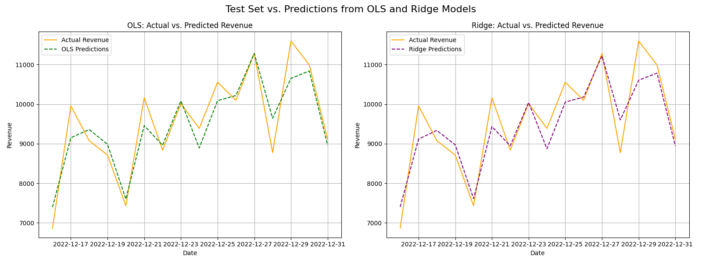

# marketing-mix-model

This project demonstrates an end-to-end Marketing Mix Modeling (MMM) analysis. It leverages advanced data science techniques to quantify the causal impact of different marketing channels on revenue. The model successfully explains over 88% of revenue variance and provides data-driven insights for optimizing marketing spend.

### Key Insights & Findings

**The Model is Statistically Robust:** A multicollinearity check using VIF confirmed that all variables are independent, with scores well below the threshold of 5. The OLS model achieved a high R² of **0.882**, explaining a significant portion of the total revenue.

**Optimized Adstock Rates Revealed Channel-Specific Behavior:** By tuning the adstock decay rates, the model found that channels like **Google Performance Max** and **Radio Ads** have a short-term, fast-decaying impact, while others like **Influencers** and **TV Ads** have a long-lasting effect.

**Top-Performing Channels Were Identified:** The model successfully attributed revenue to the marketing channels. The top three contributors were:

    **Radio Ads:** 30.12%

    **Facebook Product Catalog Sales:** 25.34%

    **Google Performance Max:** 24.28%

**Model Validated:** The OLS model's performance was slightly better than the Ridge model on the test set (RMSE: **$470.30**), which validated that the initial variable selection and adstock transformations had already addressed any underlying data issues.

### Methodology

* **Data Cleaning:** Pre-processed the dataset, handling dates and column names.

* **Adstock Transformation:** Applied a geometrically decaying adstock transformation to model the long-term impact of marketing campaigns.

* **Hyperparameter Tuning:** Optimized adstock decay rates for each channel and the Ridge Regression alpha using a time-series cross-validation approach.

* **Model Comparison:** Compared a baseline OLS model with a regularized Ridge Regression model to ensure the most stable and robust coefficients.

* **Validation:** Used a temporal train/test split to evaluate the model on unseen future data, and a VIF check to ensure the model's coefficients are reliable.

### Repository Contents

* **run_analysis.py:** The main script that orchestrates the entire analysis pipeline.

* **src/:** A directory containing the core modular functions.

    **data_processing.py:** Functions for data loading and adstock transformations.

    **modeling.py:** All modeling, cross-validation, and plotting functions.

* **data/:** Contains the raw dataset.

* **requirements.txt:** A list of all required Python libraries.

* **market_mix.ipynb:** The Jupyter notebook used for initial exploration and experimentation.

### How to Run the Code

1.  Clone this repository to your local machine.

2.  Navigate to the project directory in your terminal.

3.  Install the required libraries: pip install -r requirements.txt

4.  Run the main script: python run_analysis.py

### Model Predictions vs. Actuals

