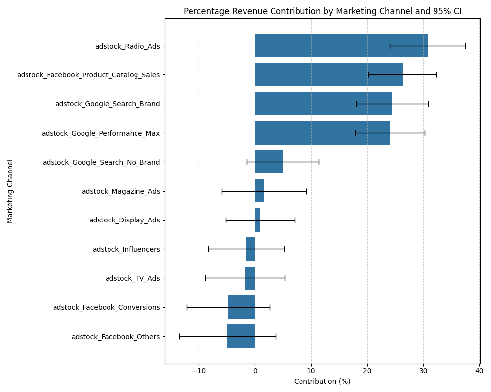

# marketing-channels-effectiveness-analysis

This project is a Marketing Channel Effectiveness Analysis using regression-based modeling. It quantifies the incremental sales lift from various marketing channels and provides data-driven insights for optimizing marketing spend.

### Key Insights & Findings

**The Model Is Statistically Robust:** A multicollinearity check using VIF confirmed that all variables are independent, with scores well below the threshold of 5. The model demonstrated strong predictive power on the test set, with a low RMSE, indicating that it accurately captures the relationships between marketing spend and sales.

**Optimized Adstock Rates Revealed Channel-Specific Behavior:** By tuning the adstock decay rates, the model found that channels like **Google Performance Max** and **Radio Ads** have a short-term impact.

**Top-Performing Channels Identified:** The model successfully attributed incremental sales lift to the marketing channels. The top three contributors to sales lift were:

    **Radio Ads:** 30.12%

    **Facebook Product Catalog Sales:** 25.34%

    **Google Performance Brand:** 24.28%

**Model Validated:** The OLS model's performance was evaluated on a temporal test set, with a low RMSE ($470.30) confirming its out-of-sample predictive accuracy. The performance of both the OLS and Ridge models was compared to ensure the stability and robustness of the coefficients.

### Methodology

* **Data Cleaning:** Pre-processed the dataset, handling dates and column names.

* **Adstock Transformation:** Applied a geometrically decaying adstock transformation to model the long-term impact of marketing campaigns.

* **Hyperparameter Tuning:** Optimized adstock decay rates for each channel and the Ridge Regression alpha using a time-series cross-validation approach.

* **Model Comparison:** Compared a baseline OLS model with a regularized Ridge Regression model to ensure the most stable and robust coefficients.

* **Validation:** Used a temporal train/test split to evaluate the model on unseen future data, and a VIF check to ensure the model's coefficients are reliable.

### Repository Contents

* **run_analysis.py:** The main script that orchestrates the entire analysis pipeline.

* **src/:** A directory containing the core modular functions.

    **data_processing.py:** Functions for data loading and adstock transformations.

    **modeling.py:** All modeling, cross-validation, and plotting functions.

* **data/:** Contains the raw dataset.

* **requirements.txt:** A list of all required Python libraries.

* **market_mix.ipynb:** The Jupyter notebook used for initial exploration and experimentation.

### How to Run the Code

1.  Clone this repository to your local machine.

2.  Navigate to the project directory in your terminal.

3.  Install the required libraries: pip install -r requirements.txt

4.  Run the main script: python run_analysis.py

### Model Predictions vs. Actuals

### Summary and conclusions

* Reliable positive drivers: Radio Ads, Facebook Product Catalog, Google Performance Brand - all have significant positive coefficients ($p\approx 0.000$, CIs exclude zero), so they are robustly associated with higher revenue in this model

* Negatives inconclusive: Several channels show negative point estimates (Facebook conversions, Facebook Others, Influencers, TV Ads), but ther are not statistically significant (95% CIs include zero), so there's not reliable evidence they reduce revenue.

* Multicollinearity not the main issue: Feature VIFs are modest ($\leq 3.5$).

* Actionable next steps before budget decisions:  a more robust analysis is needed before making causal decisions.
